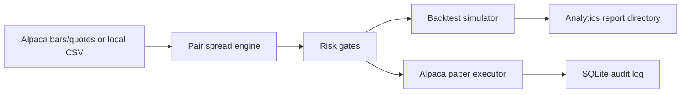

# ETF Pairs Trading Engine

Rust research and paper-trading engine for ETF relative-value strategies. The project combines a configurable pair-spread signal engine, historical CSV/Alpaca backtesting, walk-forward validation, Alpaca paper-trading integration, risk controls, SQLite audit logging, and reproducible analytics reports.

This is solely intended to demonstrate trading-system engineering and it is not financial advice or production live-trading infrastructure.

## What It Does

- Computes ETF pair spreads as `price_A - beta * price_B`.
- Generates z-score based long-spread, short-spread, and convergence-exit decisions.
- Runs synthetic simulation without broker credentials.
- Backtests Alpaca or local CSV bars with slippage assumptions.
- Produces analytics artifacts: trade-level PnL attribution, drawdown curves, per-pair summaries, markouts, and slippage sensitivity.
- Runs walk-forward CSV validation with explicit train/test folds.
- Connects to Alpaca paper trading with risk gates and SQLite audit tables.

## Architecture



See [docs/ARCHITECTURE.md](docs/ARCHITECTURE.md) for the sanitized system diagram and component notes.

## Quickstart

```bash
cd etf_pairs_engine
cargo test
cargo run -- sim
```

Run a reproducible synthetic CSV backtest and generate analytics:

```bash
cargo run -- backtest-csv \
  --bars-csv examples/sample_pairs_bars.csv \
  --pair-id DEMO_PAIR \
  --a DEMOA \
  --b DEMOB \
  --beta 1.0 \
  --window 5 \
  --min-samples 5 \
  --entry-zscore 1.0 \
  --exit-zscore 0.25 \
  --max-holding-bars 4 \
  --leg-notional 1000 \
  --slippage-bps 1 \
  --report-dir tmp_reports/demo_backtest
```

The report directory contains:

- `trades.csv`
- `pair_summary.csv`
- `equity_curve.csv`
- `drawdown_curve.csv`
- `markouts.csv`
- `slippage_sensitivity.csv`
- `assumptions.md`

More setup details are in [docs/QUICKSTART.md](docs/QUICKSTART.md).

## Configuration Files

The default config is deliberately small and cautious. It enables only `QQQ/XLK` so a new user can run simulation or paper mode without immediately activating the full research universe.

The broader tested universes live in separate configs:

- `etf_pairs_engine/config/default.toml`: minimal one-pair demo/paper config with `QQQ/XLK`.
- `etf_pairs_engine/config/optimized_mix.toml`: broader mixed-timeframe research candidate with 11 enabled pairs from the latest optimized run.
- `etf_pairs_engine/config/conservative.toml`: stricter paper/live candidate with only the pairs that survived the conservative holdout.
- `etf_pairs_engine/config/six_pair_vol_adjusted_4h.toml`: six-pair volatility-adjusted validation config.

Use the default config for first-run safety. Use `optimized_mix.toml` when you want to inspect or rerun the full optimized research universe.

## Validation

The preferred research flow is:

1. Generate or load historical bars.
2. Train parameters on an earlier window.
3. Evaluate only on the next unseen window.
4. Review fold-level out-of-sample results.

See [docs/QUICKSTART.md](docs/QUICKSTART.md) and [docs/RISK_AND_LIMITATIONS.md](docs/RISK_AND_LIMITATIONS.md).

## Status

Working research and paper-trading system under active development. The core strategy, backtesting, reporting, config, and Alpaca paper-trading paths exist. Remaining production-hardening work includes streaming order updates, fuller fill-aware state persistence, broker reconciliation hardening, explicit operator kill switches, and longer out-of-sample validation.
