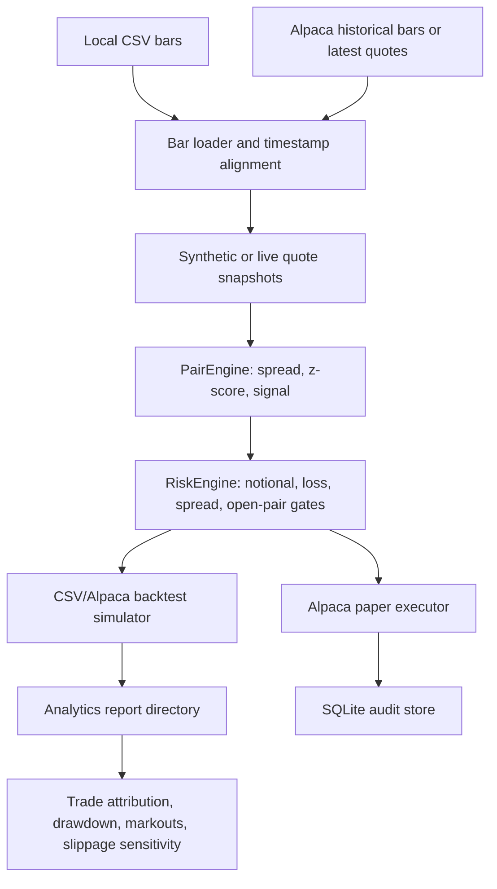

# Architecture

## Components

- `alpaca`: broker gateway, REST client, mock gateway, quotes, orders, assets, historical bars.
- `pairs`: rolling spread statistics, beta/z-score signal generation, pair-level decisions.
- `risk`: portfolio and pair-level controls.
- `execution`: paired order construction, passive/aggressive pricing, paper execution lifecycle.
- `backtest`: historical bar alignment, strategy replay, walk-forward validation, analytics artifact generation.
- `analytics`: filesystem helpers for generated report directories.
- `storage`: SQLite audit tables for paper/live observability.

## Runtime Paths

### Simulation

`cargo run -- sim` uses the mock gateway and doesn't require credentials.

### CSV Backtest

`cargo run -- backtest-csv ... --report-dir <dir>` loads local bars, replays the strategy, and writes analytics artifacts.

### Walk-Forward CSV

`cargo run -- walk-forward-csv ... --report-dir <dir>` trains parameters on each fold and evaluates the next unseen slice.

### Alpaca Paper

`cargo run -- --config config/conservative.toml run` connects to Alpaca paper trading.
